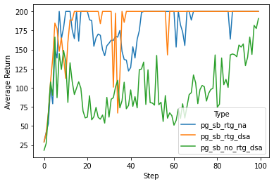
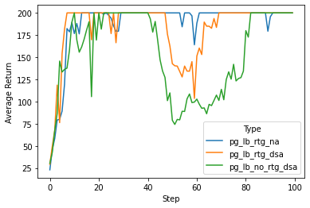
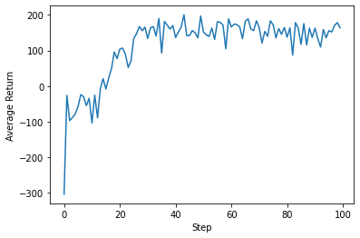
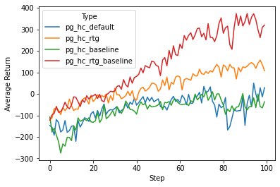

# CS285 hw2

## Question 3
#### CartPole - Small Batch Size

#### CartPole - Large Batch Size

```
python run_hw2_policy_gradient.py --env_name CartPole-v0 -n 100 -b 1000 -dsa --exp_name sb_no_rtg_dsa

python run_hw2_policy_gradient.py --env_name CartPole-v0 -n 100 -b 1000 -rtg -dsa --exp_name sb_rtg_dsa

python run_hw2_policy_gradient.py --env_name CartPole-v0 -n 100 -b 1000 -rtg --exp_name sb_rtg_na

python run_hw2_policy_gradient.py --env_name CartPole-v0 -n 100 -b 5000 -dsa --exp_name lb_no_rtg_dsa

python run_hw2_policy_gradient.py --env_name CartPole-v0 -n 100 -b 5000 -rtg -dsa --exp_name lb_rtg_dsa

python run_hw2_policy_gradient.py --env_name CartPole-v0 -n 100 -b 5000 -rtg --exp_name lb_rtg_na
```

### Q3.1 Which value estimator has better performance without advantage-standardization: the trajectory-centric one, or the one using reward-to-go?
    The one with reward-to-go has better performance.

### Q3.2 Did advantage standardization help?
    Yes

### Q.3 Did the batch size make an impact?
    Yes


## Question 4
#### Inverted Pendulum

<br>
    batch size: 500, learning rate: 5e-3
<br>

    python scripts/run_hw2_policy_gradient.py --env_name  InvertedPendulum-v2 --ep_len 1000 --discount 0.9 -n 100 -l 2 -s 64 -b 500 -lr 0.005 -rtg --exp_name ip_b50_r5e-3

## Question 6
#### Lunar Lander



## Question 7
#### Half Cheeta

<br>

    python scripts/run_hw2_policy_gradient.py --env_name HalfCheetah-v2 --ep_len 150 --discount 0.95 -n 100 -l 2 -s 32 -b 50000 -lr 0.02 --exp_name hc_b50000_r0.02
<br>

    python scripts/run_hw2_policy_gradient.py --env_name HalfCheetah-v2 --ep_len 150 --discount 0.95 -n 100 -l 2 -s 32 -b 50000 -lr 0.02 -rtg --exp_name hc_b50000_r0.02
<br>

    python scripts/run_hw2_policy_gradient.py --env_name HalfCheetah-v2 --ep_len 150 --discount 0.95 -n 100 -l 2 -s 32 -b 50000 -lr 0.02 --nn_baseline --exp_name hc_b50000_r0.02
<br>

    python scripts/run_hw2_policy_gradient.py --env_name HalfCheetah-v2 --ep_len 150 --discount 0.95 -n 100 -l 2 -s 32 -b 50000 -lr 0.02 -rtg --nn_baseline --exp_name hc_b50000_r0.02

