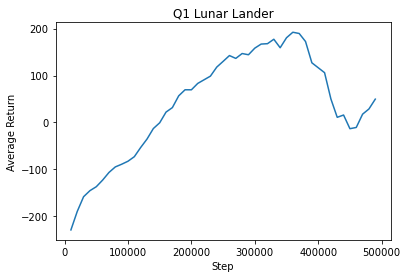

# CS285 hw3

## Question 1

#### DQN - LunarLander 

    xvfb-run -a python scripts/run_hw3_dqn.py --env_name LunarLander-v2 --exp_name q1_lunarlander

## Question 2
#### DQN vs Double DQN - LunarLander

    xvfb-run -a python scripts/run_hw3_dqn.py --env_name LunarLander-v2 --exp_name q2_dqn_1 --seed 1
 

    xvfb-run -a python scripts/run_hw3_dqn.py --env_name LunarLander-v2 --exp_name q2_dqn_2 --seed 2
 

    xvfb-run -a python scripts/run_hw3_dqn.py --env_name LunarLander-v2 --exp_name q2_dqn_3 --seed 3
 

    xvfb-run -a python scripts/run_hw3_dqn.py --env_name LunarLander-v2 --exp_name q2_doubledqn_1 --double_q --seed 1
 

    xvfb-run -a python scripts/run_hw3_dqn.py --env_name LunarLander-v2 --exp_name q2_doubledqn_2 --double_q --seed 2
 

    xvfb-run -a python scripts/run_hw3_dqn.py --env_name LunarLander-v2 --exp_name q2_doubledqn_3 --double_q --seed 3

## Question 3
#### DQN - LunarLander

    xvfb-run -a python scripts/run_hw3_dqn.py --env_name LunarLander-v2 --exp_name q3_hparam1 --batch_size 64
 

    xvfb-run -a python scripts/run_hw3_dqn.py --env_name LunarLander-v2 --exp_name q3_hparam2 --batch_size 128
 

    xvfb-run -a python scripts/run_hw3_dqn.py --env_name LunarLander-v2 --exp_name q3_hparam3 --batch_size 16

## Question 4
#### ActorCritic - CartPole

`ac_100_1` and `ac_1_100` work best compared to other settings.

Note Type `ac_{target_update}_{gradient_updates}` means `gradient_updates` gradient update steps per target update step, and `target_update` target update steps.

 

    xvfb-run -a python scripts/run_hw3_actor_critic.py --env_name CartPole-v0 -n 100 -b 1000 --exp_name 1_1 -ntu 1 -ngsptu 1
 

    xvfb-run -a python scripts/run_hw3_actor_critic.py --env_name CartPole-v0 -n 100 -b 1000 --exp_name 100_1 -ntu 100 -ngsptu 1
 

    xvfb-run -a python scripts/run_hw3_actor_critic.py --env_name CartPole-v0 -n 100 -b 1000 --exp_name 1_100 -ntu 1 -ngsptu 100
 

    xvfb-run -a python scripts/run_hw3_actor_critic.py --env_name CartPole-v0 -n 100 -b 1000 --exp_name 10_10 -ntu 10 -ngsptu 10

## Question 5
