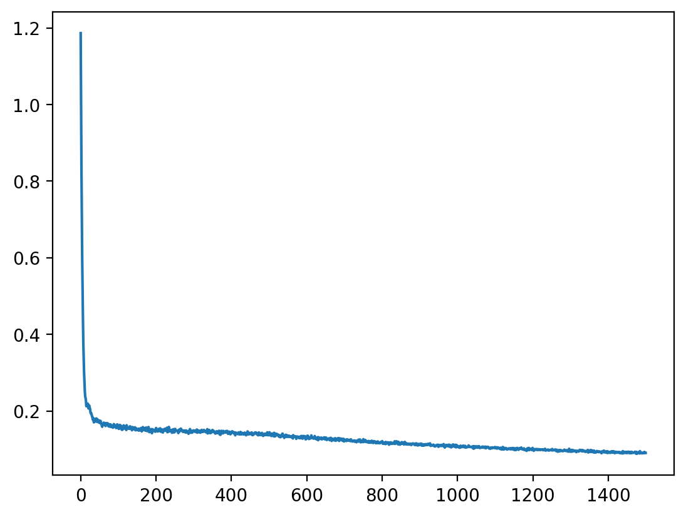

# CS285 hw4

## Question 1

### cheetah_n500_arch1x32

<table>
    <tr>
        <td>
        
        </td>
        <td>
        
        </td>
    </tr>
</table>

```
python scripts/run_hw4_mb.py --exp_name cheetah_n500_arch1x32 --env_name cheetah-cs285-v0 --add_sl_noise --n_iter 1 --batch_size_initial 20000 --num_agent_train_steps_per_iter 500 --n_layers 1 --size 32 --scalar_log_freq -1 --video_log_freq -1
```

### cheetah_n5_arch2x250
<table>
    <tr>
        <td>
        
        </td>
        <td>
        
        </td>
    </tr>
</table>

```
python scripts/run_hw4_mb.py --exp_name cheetah_n5_arch2x250 --env_name cheetah-cs285-v0 --add_sl_noise --n_iter 1 --batch_size_initial 20000 --num_agent_train_steps_per_iter 5 --n_layers 2 --size 250 --scalar_log_freq -1 --video_log_freq -1
```

### cheetah_n500_arch2x250
<table>
    <tr>
        <td>
        
        </td>
        <td>
        
        </td>
    </tr>
</table>

```
python scripts/run_hw4_mb.py --exp_name cheetah_n500_arch2x250 --env_name cheetah-cs285-v0 --add_sl_noise --n_iter 1 --batch_size_initial 20000 --num_agent_train_steps_per_iter 500 --n_layers 2 --size 250 --scalar_log_freq -1 --video_log_freq -1
```

## Question 2

### Obstacles 


<table>
    <tr>
        <td>
        
        </td>
        <td>
        
        </td>
    </tr>
</table>

```
    python scripts/run_hw4_mb.py --exp_name obstacles_singleiteration --env_name obstacles-cs285-v0 --add_sl_noise --num_agent_train_steps_per_iter 20 --n_iter 1 --batch_size_initial 5000 --batch_size 1000 --mpc_horizon 10
```


## Question 3

### Obstacles
<table>
    <tr>
        <td>
        
        </td>
        <td>
        
        </td>
    </tr>
</table>

```
python scripts/run_hw4_mb.py --exp_name obstacles --env_name obstacles-cs285-v0 --add_sl_noise --num_agent_train_steps_per_iter 20 --batch_size_initial 5000 --batch_size 1000 --mpc_horizon 10 --n_iter 12 --video_log_freq -1
```

### Reacher
<table>
    <tr>
        <td>
        
        </td>
        <td>
        
        </td>
    </tr>
</table>

```
python scripts/run_hw4_mb.py --exp_name reacher --env_name reacher-cs285-v0 --add_sl_noise --mpc_horizon 10 --num_agent_train_steps_per_iter 1000 --batch_size_initial 5000 --batch_size 5000 --n_iter 15 --video_log_freq -1
```

### Cheeta

<table>
    <tr>
        <td>
        
        </td>
        <td>
        
        </td>
    </tr>
</table>

```
python scripts/run_hw4_mb.py --exp_name cheetah --env_name cheetah-cs285-v0 --mpc_horizon 15 --add_sl_noise --num_agent_train_steps_per_iter 1500 --batch_size_initial 5000 --batch_size 5000 --n_iter 20 --video_log_freq -1
```

## Question 4
### horizon


```
python scripts/run_hw4_mb.py --exp_name q5_reacher_horizon5 --env_name reacher-cs285-v0 --add_sl_noise --mpc_horizon 5 --num_agent_train_steps_per_iter 1000 --batch_size 800 --n_iter 15 --video_log_freq -1
```

```
python scripts/run_hw4_mb.py --exp_name q5_reacher_horizon15 --env_name reacher-cs285-v0 --add_sl_noise --mpc_horizon 15 --num_agent_train_steps_per_iter 1000 --batch_size 800 --n_iter 15 --video_log_freq -1
```

```
python scripts/run_hw4_mb.py --exp_name q5_reacher_horizon30 --env_name reacher-cs285-v0 --add_sl_noise --mpc_horizon 30 --num_agent_train_steps_per_iter 1000 --batch_size 800 --n_iter 15 --video_log_freq -1
```

### numseq


```
python scripts/run_hw4_mb.py --exp_name q5_reacher_numseq100 --env_name reacher-cs285-v0 --add_sl_noise --mpc_horizon 10 --num_agent_train_steps_per_iter 1000 --batch_size 800 --n_iter 15 --mpc_num_action_sequences 100 --video_log_freq -1
```

```
python scripts/run_hw4_mb.py --exp_name q5_reacher_numseq1000 --env_name reacher-cs285-v0 --add_sl_noise --mpc_horizon 10 --num_agent_train_steps_per_iter 1000 --batch_size 800 --n_iter 15 --mpc_num_action_sequences 1000 --video_log_freq -1
```

### ensemble


```
python scripts/run_hw4_mb.py --exp_name q5_reacher_ensemble1 --env_name reacher-cs285-v0 --ensemble_size 1 --add_sl_noise --mpc_horizon 10 --num_agent_train_steps_per_iter 1000 --batch_size 800 --n_iter 15 --video_log_freq -1
```

```
python scripts/run_hw4_mb.py --exp_name q5_reacher_ensemble3 --env_name reacher-cs285-v0 --ensemble_size 3 --add_sl_noise --mpc_horizon 10 --num_agent_train_steps_per_iter 1000 --batch_size 800 --n_iter 15 --video_log_freq -1
```

```
python scripts/run_hw4_mb.py --exp_name q5_reacher_ensemble5 --env_name reacher-cs285-v0 --ensemble_size 5 --add_sl_noise --mpc_horizon 10 --num_agent_train_steps_per_iter 1000 --batch_size 800 --n_iter 15 --video_log_freq -1
```
