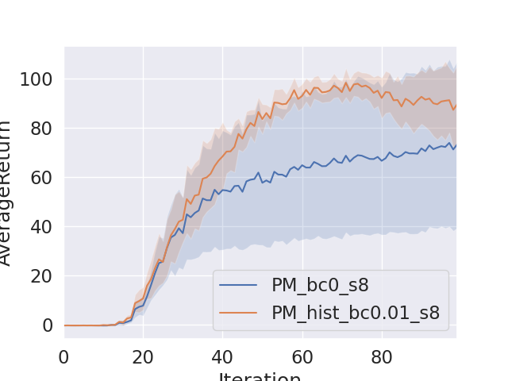
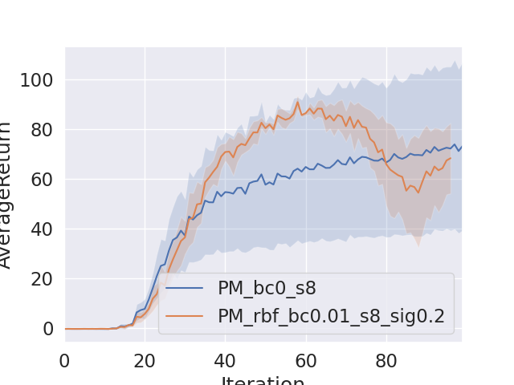
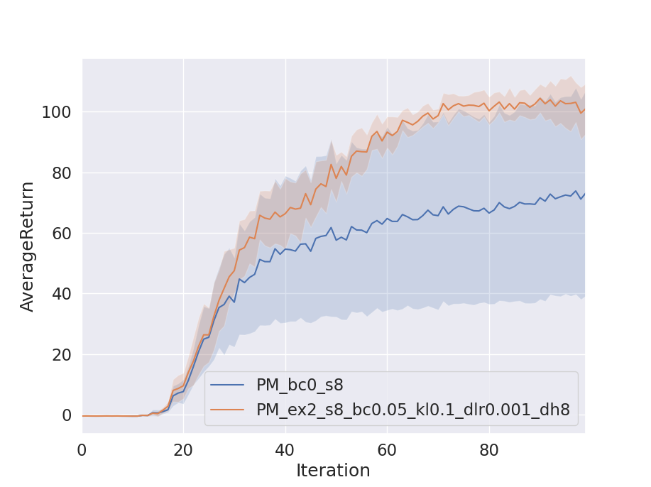
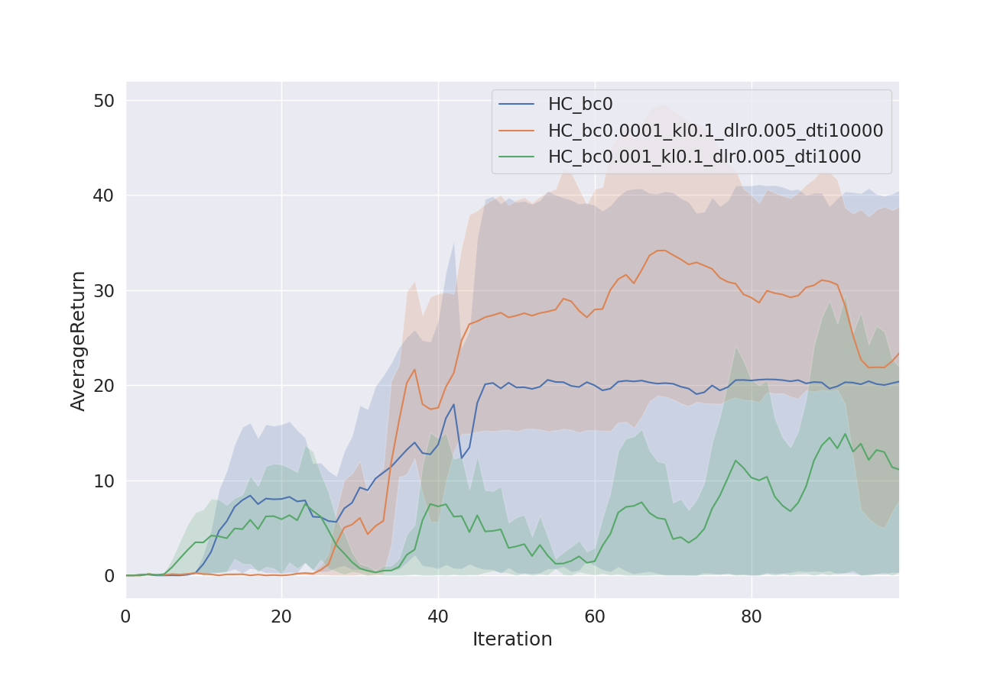

# CS285 hw4

## Question 1

### Histrogram vs No Exploration

## Question 2

### RBF vs No Exploration

## Question 3

### EX2 vs No Exploration

## Question 4

### EX2 vs No Exploration

It can be seen that the setting where bonus weight is 0.001 requires longer iterations to surpass the baseline setting where no exloration strategy is used. High bonus weight of 0.001 encourages the agent to explore suboptimal states rather than exploiting the known optimal states. For the setting with small bonus weight, the agent is more greedy than the previous agent causing the performance to surpass the baseline setting after iteration 30.
